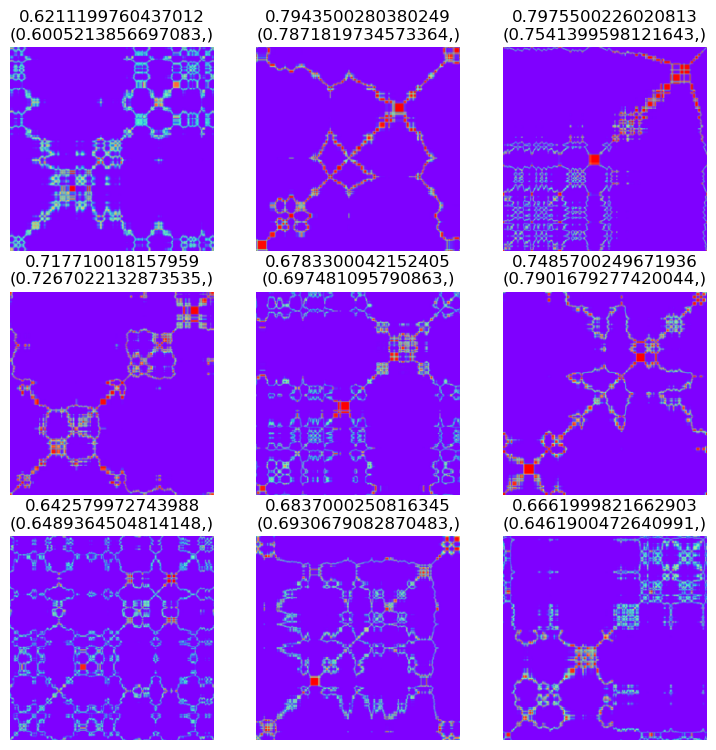

# Fractality Analysis of Converted Text to Images Using Deep Neural Models

In the previous [post](https://github.com/mohsenim/Text-Image-NN-Classifier/blob/main/text_to_image__fractality_regression.md), I talked about long text classification using pre-trained image processing models. I explained how we can analyze the structure of text by converting a very long text into a time series of text properties, and subsequently transform it into an image and finally using powerful pre-trained image processing model to analyze the text. Markov Transition Field (MTF) was explained thoroughly and some examples of sentence length series derived from three texts were shown. If you have not read that post, you will probably want to look at it first before going forward.

I show those examples here again:

As I mentioned in the previous post and you can see in the above figure, it seems that the output of MTF exhibits fractal-like patterns. This idea was further supported as I experimented with shuffling the sequence of values in the series that resulted in a more noisy pattern, and we know that shuffling values may destroy long-range correlations in time series. The following figure shows the output of MTF applied to the shuffled series.

To examine more deeply whether images derived from text property series preserve fractal features, I conducted an experiment. Similar to the previous experiment, a text is represented in the form of a sequence of text properties and converted to an image using MTF. Then a pre-trained deep neural model is fine-tuned to predict the degree of fractality of the text.

## Transformation of Text to Images

Avoiding complexity and complicated text properties, I used simply series of sentence lengths to represent texts. Moreover, there are studies that confirm that text exhibits fractality and long-range correlations in the sequence of sentence lengths (see, for example, Drozdz et al., 2015 and Mohseni et al., 2021).

After representation of texts in the form of sentence length series, MTF was applied to the series to convert each text into an image. For more detail to know how MTF works, refer to [here](https://github.com/mohsenim/Text-Image-NN-Classifier/blob/main/text_to_image__classification.md#converting-time-series-into-images).

## Computation of Degree of Fractality of Text

Multi-Fractal Detrended Fluctuation Analysis ([MFDFA](https://github.com/mohsenim/Multifractality#multi-fractal-detrended-fluctuation-analysis-mfdfa)) is one most widely used method for analyzing fractal features of time series. I extensively covered this method in [this repository](https://github.com/mohsenim/Multifractality) and provided a Python code to apply it on time series. I used this method to extract the Degree of Fractality (H) of texts. H values are regarded as the response value in training a neural model which I explain in the next section.

## Prediction of Fractal Features Using Pre-Trained Neural Models 
I used all texts in the [JEFP Corpus](https://github.com/mohsenim/JEFP-Corpus) for this experiment. The corpus contains 76 fictional/canonical and 130 fictional/non-canonical and 185 non-fictional texts, all in all 391 texts. Sentence length series for all texts were extracted and converted to images using the MFT technique. As the degree of fractality is a continuous value, we want to train a regression model. The input is an image representing the series of sentence lengths for a text and the output is the degree of fractality (H) of the corresponding series. 

I used the `fastai` library to fine-tune `ResNet-18`, which is a convolutional neural network initially trained for image classification. Instead of classification, I used it as a regression model. The Mean Square Error (MSE) loss function was used to predict H for each input image. I also used `sklearn` to conduct a 5-fold cross-validation. The average prediction error was 0.05, which is a pretty good result. I show some randomly selected images here.

The first value above each image is the predicted degree of fractality, while the other one represents the ground truth value. As the samples show, the predicted values are very close to the degrees of fractality computed by MFDFA.

### References
* Mohseni, Mahdi,Volker Gast, and Christoph Redies (2021). “Fractality andVariability in Canonical and Non-Canonical English Fiction and in Non-Fictional Texts”. Frontiers in Psychology 12, p. 920.
* Drozdz, Stanislaw, Pawel Oswiecimka, Andrzej Kulig, Jaroslaw Kwapien, Katarzyna Bazarnik, Iwona Grabska-Gradzinska, Jan Rybicki and Rybicki Stanuszek (2015). "Quantifying origin and character of long-range correlations in narrative texts". Information Sciences (331), pp 32-44. 